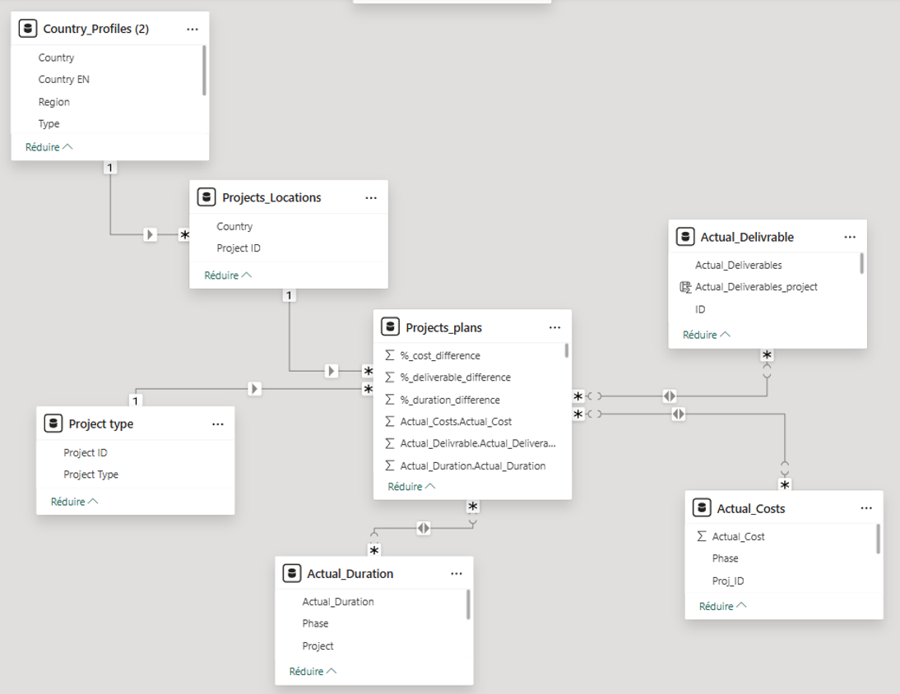
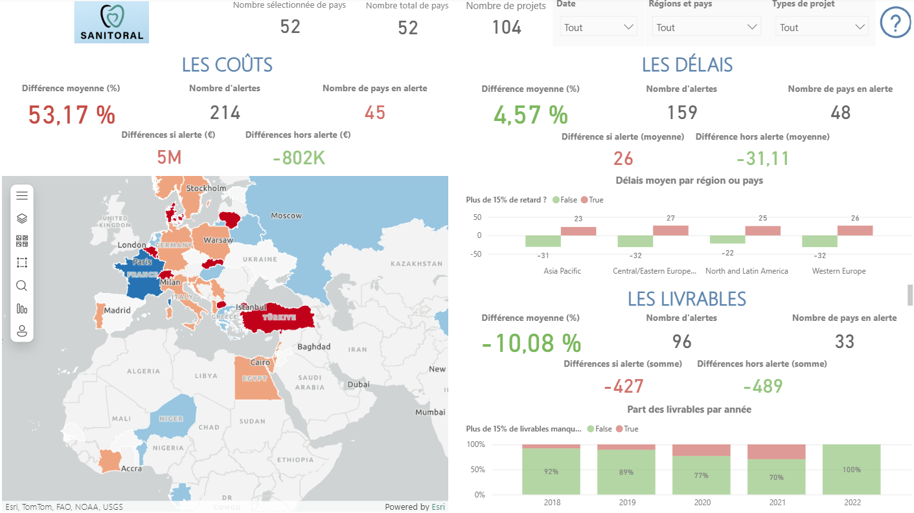
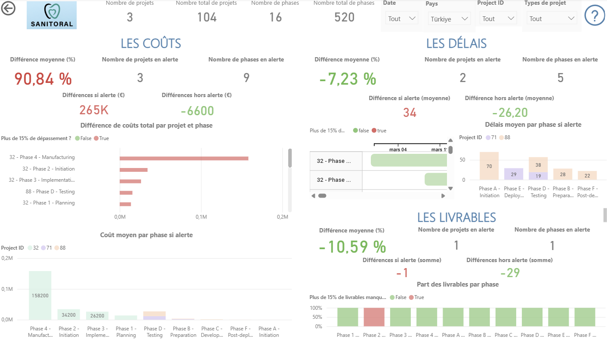

# Projet 7 – Créez un tableau de bord dynamique avec Power BI pour visualiser l'avancement de projets

## Contexte du projet

Ce projet a été réalisé dans le cadre d’un projet de **ESN Data** pour le compte de l’entreprise **Sanitoral**.  
L’objectif était de concevoir un **tableau de bord dynamique et interactif**, simple à mettre à jour, afin de suivre l’avancement des différents projets de l’entreprise.

Le tableau de bord permet de piloter les projets selon plusieurs axes :
- Coûts
- Délais
- Livrables

Il doit également permettre de **détecter rapidement les écarts significatifs** entre le prévisionnel et le réel, afin d’alerter les décideurs en cas de dérives importantes.

---

## Objectifs pédagogiques

- Produire un reporting pertinent en analysant les visualisations afin de faciliter les décisions stratégiques
- Créer un tableau de bord interactif pour rendre la visualisation des données accessible et compréhensible
- Optimiser une solution de visualisation adaptée au public cible et au type de données
- Proposer un récit des résultats à l’aide de procédés narratifs pour dynamiser la présentation
- Concevoir une restitution dynamique des résultats pour engager le public

---

## Outils utilisés

- **Power BI**

---

## Résultats du projet

Deux pages de tableau de bord ont été créées afin de répondre aux différentes granularités demandées :

- Le **Directeur Général** et les **directeurs Région** ont besoin d’une vision globale par **région et par pays**
- Les **directeurs Pays** doivent pouvoir piloter l’activité au **niveau projet**

Le tableau de bord permet, selon la granularité sélectionnée, d’identifier rapidement :
- Les zones à risque
- Les projets présentant des alertes, notamment en cas de **dépassement de plus de 15 % entre le prévisionnel et le réel**

L’objectif est de faciliter les échanges avec les équipes opérationnelles afin de :
- Comprendre les écarts de coûts, de délais et de livrables
- Identifier les causes des points de blocage
- Prendre des décisions adaptées pour corriger les dérives observées

Une attention particulière a également été portée à l’analyse des **estimations initiales**, des cas de **sous-estimation** et de **sur-estimation** ayant été constatés sur plusieurs projets.

---

## Compétences acquises

- Création d’un tableau de bord interactif avec Power BI
- Préparation et transformation des données avec **Power Query Editor**
- Apprentissage et utilisation du langage **DAX**
- Réalisation d’un **Product Strategy Canvas**
- Construction d’un modèle de données, un **schéma en étoile**
- Création d’un diagramme de Gantt et d’une carte du monde
- Configuration des rôles et des niveaux d’accès utilisateurs

---

## Illustrations

### Modèle de données

### Tableau de bord – Page 1

### Tableau de bord – Page 2

